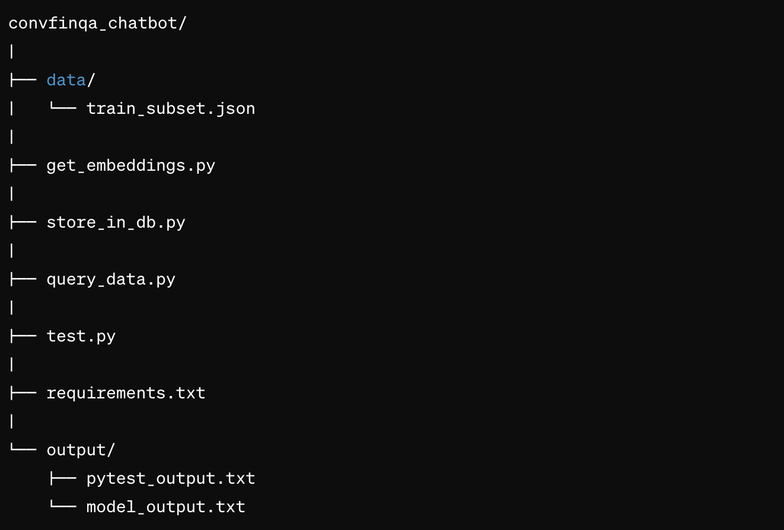

# convfinqa_chatbot

This project contains scripts for working with a vector database and utilizing a language model to generate responses based on queries.

## Folder Structure



## Description

- `data/`: This folder contains the `train_subset.json` file, which includes 50 entries of data.
  
- `get_embeddings.py`: This script is responsible for extracting embeddings from text data.
  
- `store_in_db.py`: This script loads individual entries from the JSON file into a vector database.
  
- `query_data.py`: This script queries the database and utilizes a language model to generate responses using a prompt template.
  
- `test.py`: This file contains unit tests to evaluate the performance of the language model.
  
- `requirements.txt`: This file lists all the package dependencies required for the code to run.

- `output/`: Folder for storing output files.
  - `pytest_output.txt`: Results of unit testing.
  - `model_output.txt`: Results of chatbot output

## Usage

1. Ensure you have all the necessary packages installed by running:

```bash
pip install -r requirements.txt
```

2. Ensure ollama is downloaded, installed and running in your local machine. Use the command `ollama serve` if you want to run it in the desktop without starting the application. 

3. Run the `store_in_db.py` script to load entries into the vector database.

4. Pull the LLM from the ollama server.

```bash
ollama pull mistral
```

5. Use the `query_data.py` script to query the database and generate responses using the language model.

4. Optionally, run the unit tests in `test.py` to evaluate the performance of the language model.


